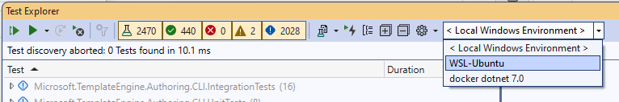

| Table of Contents |
|-------------------|
| [Getting Started](#getting-started) |
| [Build & Run](#build--run) |
| [Debugging](#debugging) |
| [Unit testing inside virtualized environment](#unit-testing-inside-virtualized-environment) |
| [Coding Style](#coding-style) |
| [Branching](#branching) |

# Getting Started #

If you're authoring templates, or interested in contributing to this repo, then you're likely interested in how to use the latest version of this experience.
The steps required are outlined below.

## Prerequisites ##

1. "git" (http://www.git-scm.com/) should be installed and added to PATH.

## Acquire

- Fork this repository.
- Clone the forked repository to your local machine.
- Checkout *main* and branch off to your feature branch (see: [branching](#branching))
- Rebase against *main* before submitting your PR.

# Build & Run

- Open up a command prompt and navigate to the root of your local repo.
- Run the build script appropriate for your environment.
     - **Windows:** [build.cmd](https://github.com/dotnet/templating/blob/main/build.cmd)
     - **Mac/Linux**: [build.sh](https://github.com/dotnet/templating/blob/main/build.sh) 

# Debugging

This repo doesn't contain an executable application anymore. We recommend to do debugging using tests.
Add your test scenario to the [test project](https://github.com/dotnet/templating/tree/main/test/Microsoft.TemplateEngine.IDE.IntegrationTests) and debug it from IDE.
To build, run and debug `dotnet new`, see the [instuctions in dotnet/sdk repo](https://github.com/dotnet/sdk#how-do-i-build-the-sdk).

# Unit testing inside virtualized environment

Unit tests can be run and debugged on a local virtualized environment supported by [Visual Studio Remote Testing](https://learn.microsoft.com/en-us/visualstudio/test/remote-testing?view=vs-2022).
Initial configurations have been added for `WSL` and net 7.0 linux docker via [`testenvironments.json`](../testenvironments.json).
Upon opening the Tests Explorrer the advanced environments are available in the GUI: 

This readme will not discuss definitive list of details of proper setup of the environments instead we deffer reader to the following information sources and warn about particular gotchas:

 * Install [WSL](https://learn.microsoft.com/en-us/windows/wsl/about).
 * Install the [distribution](https://aka.ms/wslstore) of your choice.
 * For docker runs, install [Docker Desktop](https://www.docker.com/products/docker-desktop/)
 * Third party test runners might not support this feature. Use [Visual Studio Test Explorrer](https://learn.microsoft.com/en-us/visualstudio/test/run-unit-tests-with-test-explorer).
 * First run of docker scenario might need elevation ([Test project does not reference any .NET NuGet adapter](https://developercommunity.visualstudio.com/t/test-project-does-not-reference-any-net-nuget-adap/1311698) error)  

# Coding Style #

Most of the styling is enforced by analyzers and the rules covered by the analyzers are not listed in this section. Therefore, it is highly recommended to use an IDE with Roslyn analyzers support (such as Visual Studio or Visual Studio Code).

* We only use var when the variable type is obvious.
* We avoid this, unless absolutely necessary.
* We use `_camelCase` for private fields.
* Use readonly where possible.
* We use PascalCasing to name all our methods, properties, constant local variables, and static readonly fields.
* We use `nameof(...)` instead of `"..."` whenever possible and relevant.
* We use [nullable reference types](https://docs.microsoft.com/en-us/dotnet/csharp/nullable-references) to make conscious decisions on the nullability of references, be more clear with our intent and reduce `NullReferenceException`s. Add `#nullable enabled` to the top of all the modified files unless:
  * Nullable reference types are already enabled for the file
  * The file is in one of the test projects
  * The changes you are introducing to the file are negligable in size compared to the size of the whole file,
  * You don't have enough context on the code to make decisions on nullability of types.

Some of the analyzer rules are currently being treated as "info/suggestion"s instead of "warning"s, because we have not yet done a solution wide refactoring to comply with the rules. Although it would be most welcome, you are not required to fix any of the existing suggestions. However, any code that you introduce should be free of suggestions.

[Top](#top)

# Branching #

We do development in *main* branch. After a release branch is created, any new changes that should be included in that release are cherry-picked from *main*.

We follow the same versioning as https://github.com/dotnet/sdk and release branches are named after the version numbers. For instance, `release/5.0.2xx` branch ships with .NET SDK 5.0.2xx.

| Topic | Branch |
|-------|-------|
| Development | *main* |
| Release | *release/** |

# Ways to contribute

- [create new generated symbol type](./contributing/how-to-create-new-generated-symbol.md)
- [create new value form](./contributing/how-to-create-new-value-form.md)

[Top](#top)
