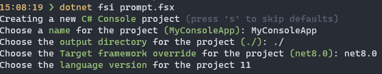

# Interactive mode for `dotnet new` instanciation

For .NET 7 `dotnet new` invested heavily in improving the UX of the tool through a comprehensive and data driven tab-completion feature. This feature, when enabled, helps users a) correctly instantiate templates and b) acts as education about what options a template supports.

For .NET 8 we should continue investing in the UX of the `dotnet new` command to make it more interactive and easier to use. This document outlines a proposal for a new interactive mode for `dotnet new` that will guide users in a workflow-style experience, prompting for inputs where required.  This brings the .NET CLI templating experience up to par with user expectations in today's world of modern CLI experiences.

## Goals

* Provide a guided experience for users to provide values for symbols (and other items like the project name)
* Enforce required symbols, but allow for skipping optional values
* Support conditional symbols
* Only provide the interactive experience when a user has entered a command (i.e. isatty is true)
* Where possible, provide an attractive and informative prompting experience through the use of ANSI control codes and terminal formatting. When the environment doesn't support it, use 'boring' formatting.

## Non-Goals

* Provide interactivity to the entire .NET CLI
* Extend interactivity to commands like `dotnet new search` or `dotnet new list` (i.e. interactive filtering)

## Workflow

When a user invokes a template, the command should evaluate the user-provided parameters and determine if it should enter interactive mode. This is done by checking if the command is being invoked from a terminal (i.e. isatty is true) and if the command has any symbols that are of type `parameter` and are required _while also having required symbols that are not explicitly provided_. If both of these conditions are true, the command should enter interactive mode.

When interactive mode is entered, the command should prompt the user for each required symbol. If the symbol has a default value, it should be displayed as the default value with some formatting (for example, grayed out text). If the symbol has a description, it should be displayed as part of a prompt. If the symbol has a datatype, the command should validate the input and prompt the user again if the input is invalid. At each stage of the prompt, the user should be able to press a key to skip the prompt and use the default value (if one exists). At each stage of the prompt, the user should be able to press a key to skip all other prompts and use their default values (if they exist). Finally, at each stage of the prompt the user should be able to press a key and quit the entire operation.

### Detecting interactive mode

* If the `--interactive` CLI flag was passed, then interactive mode should be used.
* If the Console is not a TTY (i.e doesn't have an interactive terminal connected), then interactive mode should not be used. This can be detected via the following mechanisms
  * if `System.Console.IsOutputRedirected` then the user has redirected stdout, so we shouldn't use interactive mode
  * If the user's terminal doesn't support ANSI codes, then we shouldn't use interactive mode. Support for ANSI codes can be probed through environment variables as follows
    * on Windows, if 'WT_SESSION' is non-null then Windows Terminal is being used, so we do support ANSI codes
    * on all platforms, if the `TERM` variable is set to `dumb` then ANSI codes are not supported
    * otherwise ANSI codes should be considered to be supported

### Breaking out of the prompt loop

CTRL/CMD+C should always allow the user to break out of the prompt loop.

### Deciding on default values

Symbols may have a default value configured - if so, that value should be used as the default. Other symbols have an 'implicit default' - such behavior is defined in the ParameterConverter, and should be used if no template-defined default is provided.

### Concerns/open questions

* Many templates have symbols that are 'internal' and/or easily confused - e.g. TargetFrameworkOverride and Framework. How to coalesce these to prevent multiple prompts for something a user views as one item?
  * For the first iteration, we should have a list of symbols to skip
  * When these symbols to 'collapse', item templates may need different logic than project templates
* Some parameters are not something I'd expect a user to ever want to change - e.g. skipRestore. Should we have another property marker that hides them?
  * For initial version, prompt for these too. We can tweak logic based on feedback.
* Which of the 'general' invocation options like -n and -o should we present here?
* Should we have a new `prompt` property for this? Descriptions feel odd grammatically (which is why I didn't use them in the below example).
  * Yes, and this new property should exist only in the `dotnetcli.host.json` file

### Examples

Here's what the C# Console template might look like using just the data we have available right now:

Key points are the use of defaults where available, and the slight use of color to highlight property/symbol names vs the descriptions.
One thing that can't been seen here is the use of choices - the 'framework' parameter showed a selection prompt and let me enter that.

## References

* [MSBuild LiveLogger](https://github.com/dotnet/msbuild/tree/main/src/MSBuild/LiveLogger)
* [cargo generate](https://github.com/cargo-generate/cargo-generate)
* [yeoman](https://www.npmjs.com/package/yo)
